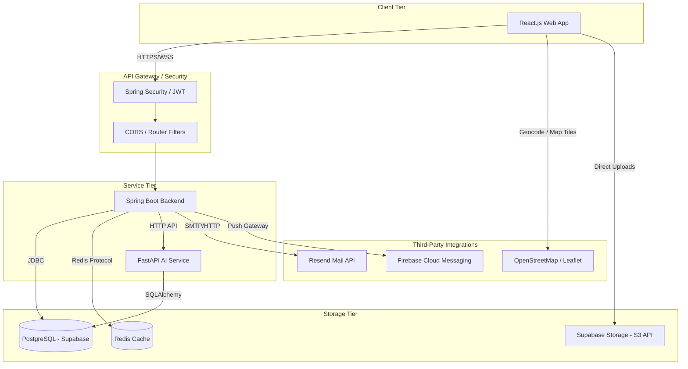
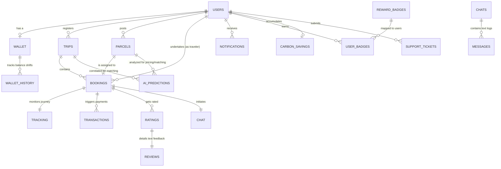
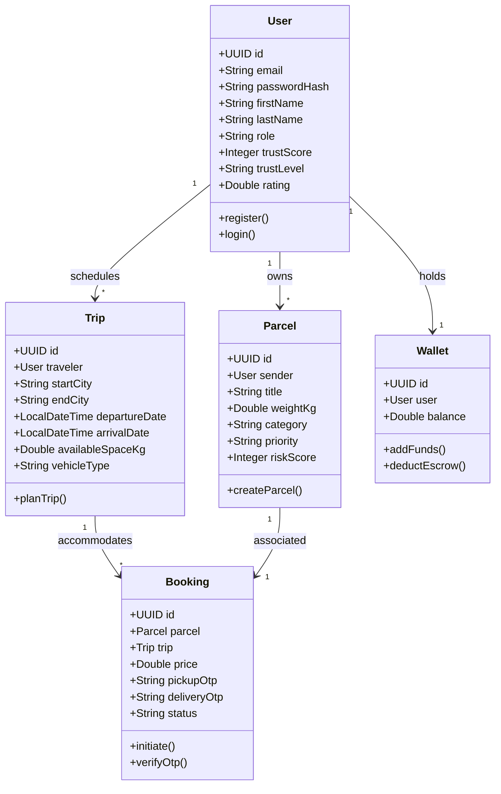
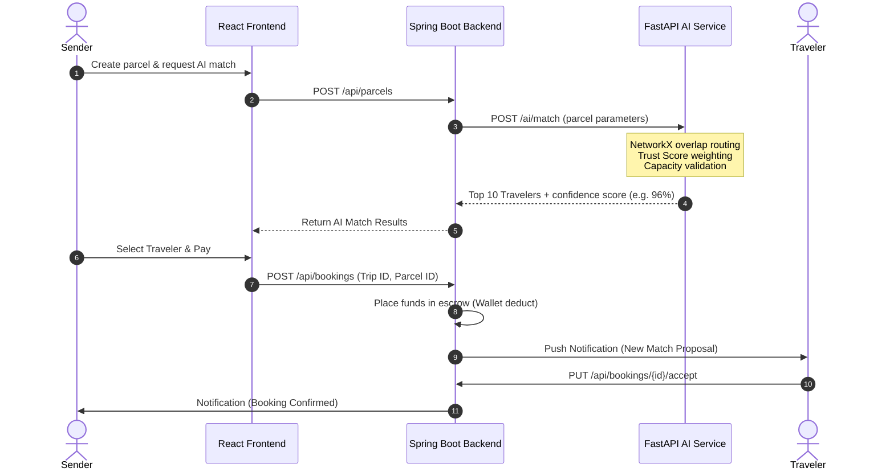
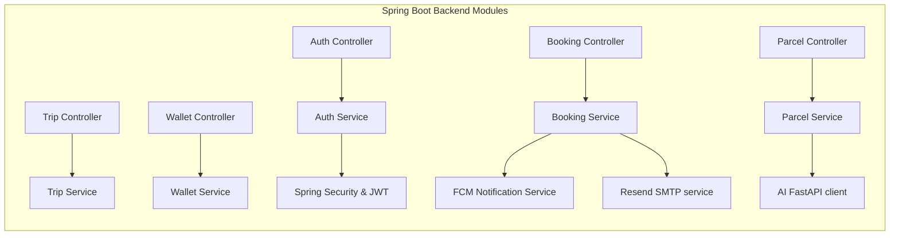
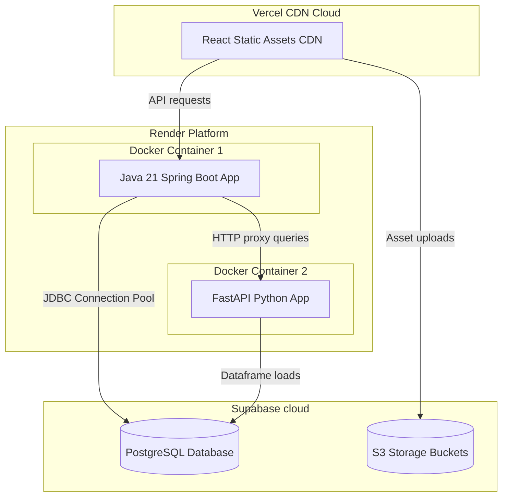

# TravelCarry AI - System Design & Architecture Document

Welcome to the System Design documentation for **TravelCarry AI** ("Deliver While You Travel"). This document details the architectural blueprints, database models, class relationships, interactions, and components.

---

## 1. System Architecture Diagram
A high-level view showing the interactions between the React frontend, Spring Boot backend, FastAPI AI service, PostgreSQL database, and third-party integrations.



---

## 2. Entity-Relationship (ER) Diagram
Shows the database tables, fields, constraints, and relationships.



---

## 3. Use Case Diagram
Visualizes user roles (Traveler, Sender, Admin) and their interactions with the system.

```mermaid
left-to-right direction
flowchart TD
    subgraph Users
        Sender[Sender]
        Traveler[Traveler]
        Admin[System Admin]
    end

    subgraph System Features
        UC1(Create Trip)
        UC2(Post Parcel)
        UC3(Find AI Matches)
        UC4(Approve Booking)
        UC5(Update Real-time Tracking)
        UC6(Generate OTP Verification)
        UC7(Execute Payment Escrow)
        UC8(View Trust/Carbon Dashboard)
        UC9(Monitor Live Fraud Metrics)
    end

    Traveler --> UC1
    Sender --> UC2
    Sender --> UC3
    Traveler --> UC4
    Traveler --> UC5
    Sender --> UC6
    Traveler --> UC6
    Sender --> UC7
    Traveler --> UC8
    Sender --> UC8
    Admin --> UC9
```

---

## 4. Class Diagram
Class blueprints for the Spring Boot backend layer modeling the main entity structures.



---

## 5. Sequence Diagram (Booking & Match Flow)
Illustrates step-by-step requests and responses when a Sender lists a parcel and matches with a traveler.



---

## 6. Component Diagram
Decomposes the backend services into separate logical modules.



---

## 7. Deployment Diagram
Illustrates the physical architecture where elements are deployed (Vercel, Render, Supabase).


